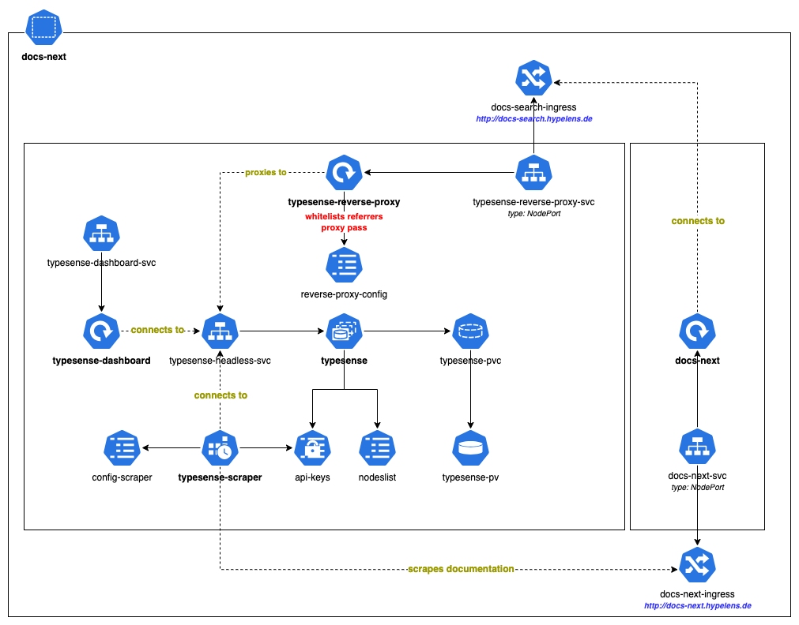

# Open Telekom Cloud Architecture Center Helm Charts

Open Telekom Cloud Architecture Center (docs-next) consists of the components listed below:

1. **docs-next**: The documentation site, based on [Docusaurus](https://docusaurus.io/).
2. **typesense**: [Typesense](https://typesense.org/) is a modern, privacy-friendly, open-source search engine  
engineered for performance & ease-of-use.
3. **typesense-scraper**: The scraper that crawls the documentation site and feeds typesense.
4. **typesense-reverse-proxy**: The reverse-proxy component to securely publish typesense endpoints externally.
5. **typesense-dashboard**: An [unofficial Typesense dashboard](https://github.com/bfritscher/typesense-dashboard) to manage and browse collections.
6. **umami**: [Umami](https://umami.is/) is a fast, privacy-focused, and open-source alternative to Google Analytics.

and packed in the following charts:

- **docs-next**: docs-next [`chart/docs-next`]
- **typesense**: typesense, typesense-scraper, typesense-reverse-proxy, typesense-dashboard [`charts/typesense`]
- **umami**: umami [`chart/umami`]



## Prerequisites

### Configuration

You are going to need:

1. Two(3) external-facing Elastic Load Balancers for the Ingress objects of **docs-next** and **typesense-reverse-proxy** and **umami-web**. 
2. Two(3) FQDN names for the external URLs of those exposed services.

Next you need to:

3. Register an A-Record in Open Telekom Cloud DNS service binding the EIP of the load balancer with the FQDN.
4. Copy the ID of Elastic Load Balancer because you will need to provide it as a value to each chart.
5. Copy the FQDN because you will need to provide it the host value of each Ingress. 

Additionally, you are going to need two(2) API keys:

6. An **admin** API key for Typesense
7. A **search-scoped** API key for docs-next (You are going to create this using either **curl** or the provisioned **typesense-dashboard**)

> [!CAUTION]
> Although you can use the **admin** key for both Typesense and documentation site it is highly discouraged to share 
> admin keys in a public facing site.

### Dependencies

**Before** installing any of these charts you have to make sure you install in your cluster the following dependencies:

1. **cert-manager**: [cert-manager](https://cert-manager.io/) is an open source project that provides X.509 certificate management for Kubernetes and OpenShift workloads.
2. **cert-manager-webhook-opentelekomcloud**: ACME DNS01 solver webhook for Open Telekom Cloud DNS, repo can be found [here](https://github.com/akyriako/cert-manager-webhook-opentelekomcloud).
3. **zalando-postgres-operator**: A custom operator that creates and manages PostgreSQL clusters running in Kubernetes, repo can be found [here](https://github.com/zalando/postgres-operator).
4. **argocd**: [Argo CD](https://argo-cd.readthedocs.io/en/stable/) is a declarative, GitOps continuous delivery tool for Kubernetes. 
   
> [!NOTE]
> - The **zalando-postgres-operator** is optional, as long as you have another way to provision internally or externally 
> PostgreSQL databases, which are required by **Umami**. 
> - **argocd** is optional as well, if you have other means to automate the provisioning in place. Nevertheless it is strongly advised to use it 

## Deployment

### Quick bits

#### Manual deployment of the documentation site

```shell
helm repo add docs-next https://akyriako.github.io/docs-next-charts
helm repo update

helm upgrade --install docs-next docs-next/docs-next \
    --set docusaurus.ingress.elbid = <docs-next elastic load balancer id> \
    --set docusaurus.ingress.host = <docs-next fqdn> \
    --set docusaurus.docusaurus.env.typesenseHost = <typesense-reverse-proxy fqdn> \
    --set apiKeys.typesenseApiKey = <search-api-key> \
    -n docs-next-preview \
    --create-namespace 
```

#### Manual deployment of the search engine

```shell
helm repo add docs-next https://akyriako.github.io/docs-next-charts
helm repo update

helm upgrade --install docs-next docs-next/typesense \
    --set typesenseReverseProxy.elbid = <typesense-reverse-proxy elastic load balancer id> \
    --set typesenseReverseProxy.host = <typesense-reverse-proxy fqdn> \
    --set docusaurus.host = <docs-next fqdn> \
    --set apiKeys.typesenseApiKey = <admin-api-key> \
    -n docs-next-preview \
    --create-namespace 
```

#### Automatic deployment with the CI/CD pipeline

If you are relying on the automated pipeline that is been built-in as a GitHub Actions Workflow in the [docs-next](https://github.com/akyriako/docs-next)
repository, you don't need to provide none of the above variables as values for the Helm charts. The GitHub Action of the other 
repository will automatically update the values in the Helm charts.

> [!IMPORTANT]
> This is the recommended way; use the manual deployment of the charts only for development and testing purposes!

### Step by Step

TBD